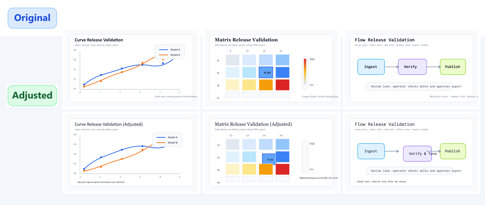

# Easy Plot v0.01

Easy Plot is the working repository for the first end-to-end implementation pass of the plotting editor system. It combines:

- the import pipeline for SVG and HTML-derived figures,
- an interactive desktop workbench for direct figure edits,
- round-trip export paths for SVG, HTML, PNG, and project JSON,
- verification scripts, smoke checks, acceptance reports, and audit documents.

Author: `ARC - SJTU PhD Student`

License: `MIT`

Copyright: `Copyright (c) 2026 ARC - SJTU PhD Student`

The repository follows a strict separation of evidence:

- `Normative`: the frozen PDF specification outside this repository,
- `Implemented`: the code and scripts in this repository,
- `Gap`: explicit mismatches tracked in `docs/implementation/` and `docs/audit/`.

## Repository Highlights

- `apps/desktop/`: desktop workbench runtime and GUI-facing editing logic
- `packages/`: parser, normalizer, lifter, editor-state, exporter, schema, and metrics packages
- `fixtures/`: curated SVG/HTML fixtures grouped by family
- `artifacts/release_suite/`: GitHub-ready showcase cases plus generated outputs
- `docs/`: reconstructed product, architecture, schema, API, acceptance, implementation, operations, and audit documents
- `scripts/`: smoke tests, release builders, and verification utilities
- `tests/`: unit, integration, end-to-end, and visual-regression coverage

## Current Capabilities

- Import SVG or HTML-based figures into a normalized IR-backed editing session
- Select and drag editable objects directly in the browser-based desktop preview
- Edit text, add new text, delete objects, undo/redo, and save/load project state
- Export adjusted figures as SVG, HTML, PNG, or project JSON
- Preserve glyph-based marker and text-path content for real matplotlib-style SVGs
- Generate release showcase assets that exercise curves, matrices, and flow diagrams

## Quick Start

### Install

```bash
npm install
```

### Build

```bash
npm run build:all
```

### Launch the desktop GUI

```bash
npm run desktop:gui -- --host 127.0.0.1 --port 5028 --no-open
```

Then open `http://127.0.0.1:5028/`.

### Run the main smoke checks

```bash
npm run smoke:ir-schema
npm run smoke:import-pipeline
npm run smoke:roundtrip-pipeline
npm run smoke:desktop-gui
```

## Release Showcase Suite

The repository now includes a small release-oriented validation suite with three complete editable cases:

- `curve_release_case.svg`: line chart / curve scenario
- `matrix_release_case.svg`: heatmap / matrix scenario
- `flow_release_case.svg`: flowchart / process diagram scenario

Each case is edited programmatically to cover the main desktop features:

- import
- single selection
- multi-selection
- drag / move
- text editing
- add text
- delete
- undo / redo
- save project
- reload project
- export SVG / HTML / PNG

Generate the full showcase bundle with:

```bash
npm run release:showcase
```

Generated outputs are written to:

- `artifacts/release_suite/generated/<case-id>/`
- `artifacts/release_suite/generated/release_suite_summary.json`
- `artifacts/release_suite/generated/release_suite_results.png`

## Release Showcase Result

The montage below is generated by the repository itself. The top row shows the original input figures; the bottom row shows the adjusted outputs after scripted edits.



## Validation Commands

### Focused integration checks

```bash
npm run test:integration -- tests/integration/desktop_real_sample_svg_interaction.test.cjs
npm run test:integration -- tests/integration/release_showcase_suite.test.cjs
```

### Full integration suite

```bash
npm run test:integration
```

### Full project validation

```bash
npm run build:all
npm run test:all
npm run smoke:all
npm run release:showcase
npm run acceptance:family
```

## Release Verification Snapshot

Last locally verified: `2026-04-03`

- `npm run build:all` : pass
- `npm run test:all` : pass
- `npm run smoke:all` : pass
- `npm run release:showcase` : pass
- `npm run acceptance:family` : pass

Current acceptance summary:

- All six tracked families report `overallPass: true`
- Release showcase bundle regenerated successfully
- Desktop GUI smoke, desktop shell smoke, store distribution smoke, and store publish CI dry-run all pass

## Release Metadata

- Author: `ARC - SJTU PhD Student`
- License: `MIT`
- Copyright: `Copyright (c) 2026 ARC - SJTU PhD Student`
- License file: `LICENSE`

## Important Paths

- Documentation index: `docs/index.md`
- Current verification report: `docs/audit/current-verification-report.md`
- Implementation state matrix: `docs/implementation/current-state-matrix.md`
- Family acceptance report: `docs/audit/family_acceptance_report.json`
- Real interaction sample: `fixtures/matplotlib/mpl_real_interaction.svg`

## Known Limitations

- Some glyph-derived labels remain editable only as proxy text objects, not as native semantic text.
- HTML import is still limited relative to the frozen target specification.
- The desktop runtime is usable for direct edits, but it is still a draft workbench rather than a final production application shell.
- Acceptance-grade family coverage is broader than before, but long-tail SVG and CSS semantics are still being expanded.

## Status

This repository is an active draft implementation and documentation-reconstruction workspace. It is suitable for:

- implementation tracking,
- debugging and regression work,
- artifact generation,
- GitHub release-oriented verification.

It should not yet be described as a finished production release.

## Release Notes

This repository is prepared for an MIT-licensed public draft release with:

- an English README,
- explicit author and copyright metadata,
- a curated release showcase bundle,
- reproducible build, test, smoke, and export entrypoints.
